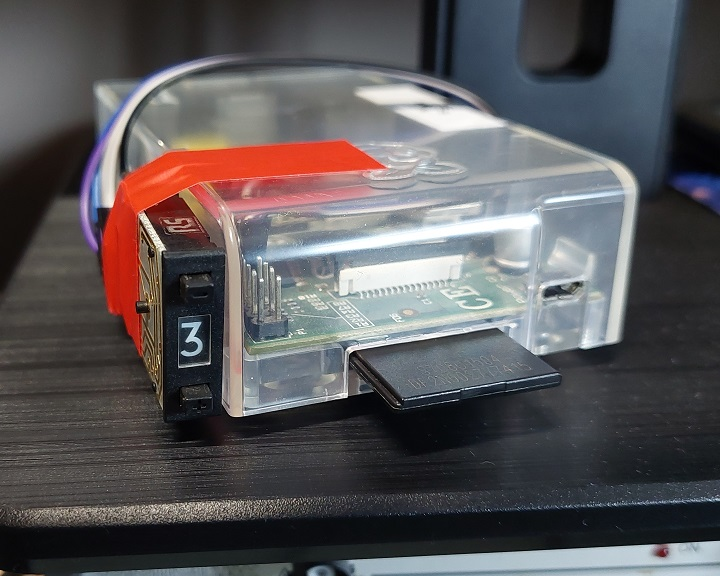

# Slideomatic

Slideomatic is a program written in Python which displays a slideshow and provides an interface for controlling music playback using a physical rotary switch. It is designed to work on the Raspberry Pi and was originally intended for use with [vbit2 and raspi-teletext](https://github.com/peterkvt80/vbit2/wiki) but does not depend on them and can be used without.

## Features

* Does *not* require a desktop environment such as X11
* Optional screen position compensation for use with raspi-teletext
* Should work on every model of Raspberry Pi (tested on an original 256MB Raspberry Pi and a Raspberry Pi 3)
* Works with composite and HDMI out
* Graphics via pygame
* Entire framebuffer area is available (unlike when using fbi)
* Draws directly to the framebuffer (composite or HDMI) even when started via ssh
* Music and internet radio playback via mpc/mpd
* Reads a BCD-coded switch connected to the Pi's GPIO to select music or internet radio station - includes filtering
* Displays caption with now playing information on the screen (automatically suppressed when not available for internet radio stations)
* Low CPU usage and power consumption

## Setup

Install dependencies

    $ sudo apt update
    $ sudo apt install python3-pygame,mpd,mpc

If using vbit2 and raspi-teletext, these can be installed the usual way with no special setup required for those.

If using the default `teletext4` font then download and install this too:

    $ wget https://github.com/peterkvt80/vbit-iv/raw/main/teletext4.ttf
    $ sudo mv teletext4.ttf /usr/share/fonts/teletext4.ttf

### Media playback

If `mpd` has been freshly installed, setup is required before media playback will work. This setup is not specific to `slideomatic` and is general for all new `mpd` installations.

For most Raspberry Pi users, all you will have to do is open the `mpd.conf` file (`sudo nano /etc/mpd.conf`) then locate the `alsa` configuration example and uncomment just the first three lines and closing brace like so:

    audio_output {
            type            "alsa"
            name            "My ALSA Device"
    #       device          "0:1"   # optional
    #       mixer_type      "software"      # optional
    #      mixer_device    "default"       # optional
    #      mixer_control   "PCM"           # optional
    #      mixer_index     "0"             # optional
    }

Then do: (important!)

    $ sudo systemctl restart mpd

On Pi Zero, if analogue audio is required, then the PWM pins need to be configured (add this to `/boot/config.txt`):

    dtoverlay=audremap,pins_12_13

And set output to headphones in `raspi-config`

#### Media selection

The `localmusicnumber` variable sets how many different local playlists there will be. For example, when set to 2, the first two positions on the switch will correspond to local playlists, and the remaining positions will correspond to internet radio stations. Local music playlists are populated according to the search criteria in the `localmusicsearchfield` and `localmusicsearchdata` arrays, and by default, mpd will search files in the `/var/lib/mpd/music` folder for files matching the criteria.

For internet radio, this should be set up by creating a fresh queue with the various URLs of internet radio stations desired added to it. These can be tested at the command line using commands like `$ mpc play 1` before saving.

Example:

    $ mpc clear
    $ mpc add <url 1>
    $ mpc add <url 2>
    $ mpc save internetradio
    
A wide range of codecs is supported by mpd including mp3, aac, ogg, opus, and flac. HTTPS is supported as well as HTTP. In addition to the usual ADTS, MPEG-DASH and HLS are also supported, but now playing metadata doesn't seem to work for those.

### Slideshow images

Add the slideshow images to the path specified by the `slideshowpath` variable.

The images are not scaled to ensure that pixel perfect rendering will always be achieved when displaying test cards.

### Other

A comprehensive range of configuration variables is available. Read through the comments to determine if any should be changed to suit your use.

Run `sudo python3 ./slideomatic.py` to start Slideomatic and test the configuration. Press Ctrl+C to exit. Note that if started via ssh, Python may stop after the session is disconnected, so it may be better to use `sudo nohup python3 slideomatic.py` instead. To run at startup, run `nohup python3 slideomatic.py` using any usual method for running programs at startup such as adding it to `/etc/rc.local` or to crontab.
